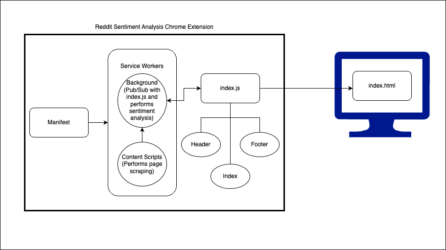

# Reddit Sentiment Analysis Chrome Extension  🚀  

Reddit Sentiment Analysis Chrome Extension is an application that scrapes reddit posts and performs sentiment analysis on them to determine if they are positive, negative, or neutral.

## Table of Contents ✨  

- [Installation](#installation)
- [Usage](#usage)
- [Architecture](#architecture)


# Installation

To install and run Reddit Sentiment Analysis Chrome Extension locally, follow these steps:

1. Clone this repository: 
2. Navigate to project directory: 

   ```
   cd CS410_Course_Project
   ```
4. Install the dependencies using npm: 
   ```
   npm install
   ```

# Usage
## Usage Locally  🔥
To run the Reddit Sentiment Analysis Chrome Extension locally, follow these steps:

Run the project:
```
npm run dev
```
`This will run project on your localhost`

 http://localhost:3000/

## Build and Import To Chrome 🔥
To build and import Reddit Sentiment Analysis Chrome Extension to chrome browser, follow these steps:

1. Build the project:
```
npm run build
```
`This will run prep and export to create new folder 'out/'`

2. Open Google Chrome and go to chrome://extensions.

3. Enable the "Developer mode" toggle switch.

4. Click on "Load unpacked" and select the out folder generated by the build process.

5. The Reddit Sentiment Analysis Chrome Extension should now be loaded as an unpacked extension in Google Chrome

6. After subsequent builds, all you need to do is refresh the extension and the latest version will be in use!

7. Note that you may have to refresh every post for tldr to work if the "Open posts in new tab" option is not enabled. To enable, go to User Settings --> Feed Settings and scroll to the bottom.


# Architecture


